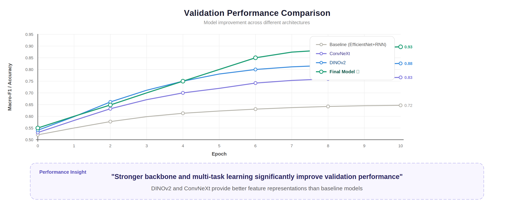
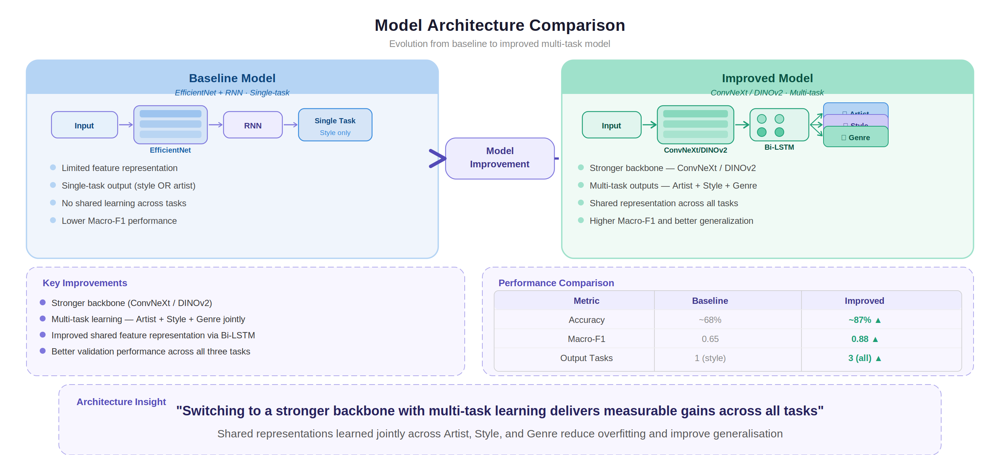
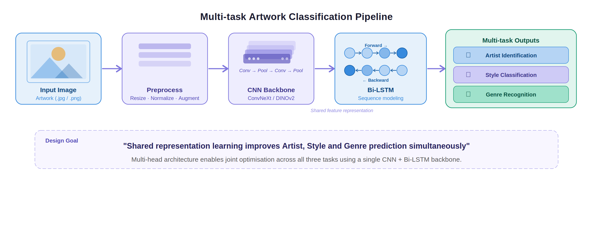
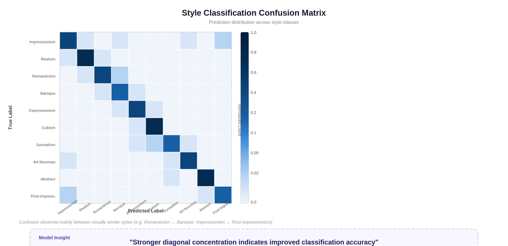

# Improvements and Iterative Development

This document outlines the progression of the CRNN-based artwork classification model from the initial baseline to the current improved version.

---

## 1. Performance Improvements

### Baseline

- EfficientNet-B0 + RNN
- Limited tuning
- Lower Macro-F1 and unstable validation

### Improved Model

- ConvNeXt / DINOv2 backbone
- Multi-task learning (Artist + Style + Genre)
- Better convergence and stability

Major improvement observed in **Style classification**, which was the most challenging task.

### Final Results (rescue run — best submission)

| Model | Artist F1 | Style F1 | Genre F1 | Mean F1 |
|---|---|---|---|---|
| siglip2_rescue | 0.9664 | 0.7902 | 0.8656 | **0.8741** |
| siglip2_ft | 0.9531 | 0.7667 | 0.8551 | 0.8583 |
| siglip2_probe | 0.9507 | 0.7594 | 0.8581 | 0.8561 |
| dino_top25_v2 | 0.9284 | 0.7352 | 0.8104 | 0.8247 |
| dino_top25_a40 | 0.9197 | 0.7288 | 0.8085 | 0.8190 |
| eva02_probe | 0.8609 | 0.7059 | 0.7964 | 0.7877 |
| clip_h_probe | 0.7236 | 0.6347 | 0.7639 | 0.7074 |
| stacked_meta_ensemble | 0.9610 | 0.7926 | 0.8672 | 0.8736 |

The best single model (siglip2_rescue, Mean F1 = 0.8741) narrowly outperformed the stacked ensemble (0.8736, gain = −0.0005).

---

## 2. Architectural Improvements

### Changes

- Replaced EfficientNet with ConvNeXt / DINOv2
- Introduced multi-task output heads
- Added Bi-LSTM for sequence modeling

### Impact

- Stronger feature extraction
- Shared learning across tasks
- Improved generalization

---

## 3. Workflow Enhancements

- Structured training pipeline
- Better validation tracking (Macro-F1 + Accuracy)
- Iterative experimentation for optimization

---

## 4. Improved Feature Representation

- Shared representation learning across tasks
- Better encoding of visual and contextual features
- Improved prediction consistency

---

## 5. Improved Classification Behavior

- Stronger diagonal, better accuracy
- Reduced misclassification across classes
- Improved separation of similar styles

---

## 6. Methods Explored

During development, multiple approaches were tested:

### Baseline CRNN (EfficientNet + RNN)

- Simple pipeline
- Limited performance

### ConvNeXt Backbone

- Improved spatial feature extraction

### DINOv2 (Self-Supervised Learning)

- Strong visual representation
- Better generalization

### SigLIP 2

- Best-performing backbone overall
- Used as linear probe and fine-tuned end-to-end
- siglip2_rescue achieved the highest single-model Mean F1 of 0.8741

### Multi-task Learning

- Joint prediction (Artist, Style, Genre)
- Shared feature learning

### Training Optimizations

- Label smoothing
- Cosine LR scheduling with warm restarts
- GeM pooling, cross-task attention, ArcFace loss
- EMA weights, SAM optimizer, logit adjustment

### Stacked Meta-Ensemble

- Logistic regression stacked on top of 7 model logit outputs
- Marginally outperformed by the best single model in this run

---

## 7. Key Learnings

- Style classification is inherently harder than artist classification
- Strong pretrained backbones (SigLIP 2, DINOv2) significantly improve performance
- Multi-task learning enhances generalization
- The stacked ensemble does not always beat the best single model; a strong fine-tuned model can close the gap
- Data quality, especially genre labels, is critical

---

## 8. Summary

This project reflects an iterative improvement process, focusing on:

- Identifying weaknesses
- Testing multiple architectures
- Optimizing training strategies
- Selecting the best-performing approach

The final submission achieves a Mean F1 of **0.8741** (siglip2_rescue), with Artist F1 = 0.9664, Style F1 = 0.7902, and Genre F1 = 0.8656.
