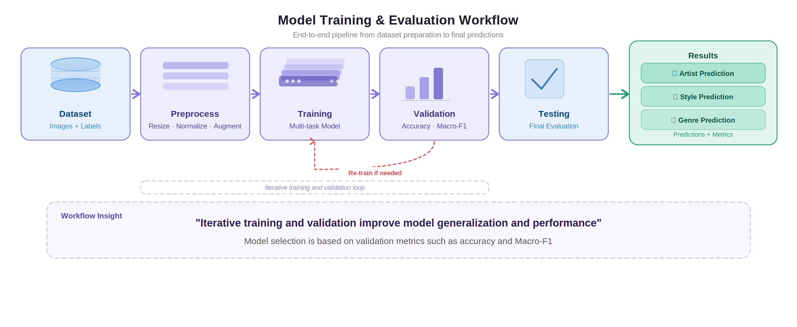
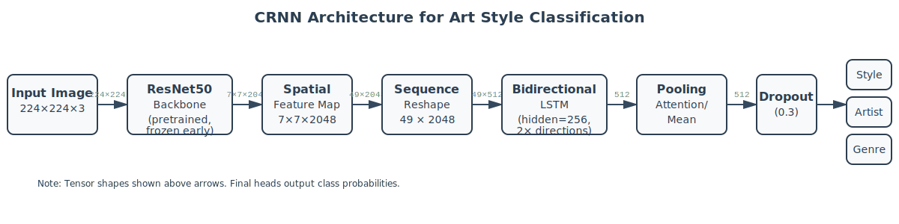

# ArtExtract CRNN Submission

This repository contains my ArtExtract submission for multi-task artwork classification. The goal is to predict three labels from the same painting:

- artist
- style
- genre

The repository name still uses `CRNN` because the project started from a CNN-RNN baseline, but the final version grew into a stronger multi-task pipeline with modern visual backbones, task-specific heads, and a stacked ensemble. I kept the original name so the work stayed traceable to the earlier baseline.

## Project Summary

The final submission is built around three ideas:

1. learn a shared visual representation for all three tasks instead of training separate models
2. use stronger pretrained backbones such as DINOv2, SigLIP 2, EVA02, and CLIP-H instead of a small baseline network
3. combine complementary models at the end with a stacked meta-ensemble

The repository includes:

- data preparation scripts for building WikiArt CSV files
- training code for multitask models
- linear probe scripts for frozen backbones
- full fine-tuning code for SigLIP 2
- evaluation utilities
- logs and reports from the final submission runs

## Final Label Setup Used In This Submission

The final submission in this repository uses:

- 25 artist classes
- 27 style classes
- 7 genre classes

The prepared CSV files for this setup are already included:

- `datasets/top25_train.csv`
- `datasets/top25_train_balanced.csv`
- `datasets/top25_val.csv`
- `datasets/top25_test.csv`

The corresponding label names are in:

- `datasets/label_maps/top25_artist_classes.txt`
- `datasets/label_maps/style_classes.txt`
- `datasets/label_maps/genre_classes.txt`

## Repository Structure

```text
CRNN/
├── datasets/
│   ├── top25_train.csv
│   ├── top25_train_balanced.csv
│   ├── top25_val.csv
│   ├── top25_test.csv
│   ├── build_wikiart_master.py
│   ├── prepare_wikiart.py
│   └── label_maps/
├── models/
│   ├── multitask_crnn.py
│   ├── siglip2_multitask.py
│   └── resnet_crnn.py
├── runs/
│   └── SLURM job scripts used on the cluster
├── results/
│   ├── Images/
│   ├── architecture.svg
│   └── top25_submission_metrics.json
├── reports/
│   └── saved ensemble reports
├── train_multitask_ddp.py
├── train_siglip2_multitask_ddp.py
├── linear_probe.py
├── siglip2_linear_probe.py
├── stacked_meta_ensemble.py
├── evaluate.py
└── download_pretrained.py
```

## Dataset

### What is included in the repository

This repository includes:

- the CSV files used for the final top-25 experiments
- label maps
- scripts to rebuild the metadata and splits

This repository does not include:

- the actual WikiArt image files
- training checkpoints
- large pretrained weight files

Those files are not pushed to GitHub because they are too large.

### What you need to download yourself

To run training or evaluation, you need a local copy of the WikiArt images. This code expects the image paths from the CSV files to be resolved relative to a folder called `wikiart/`.

The expected layout is:

```text
wikiart/
├── Impressionism/
│   ├── claude-monet_water-lilies.jpg
│   └── ...
├── Baroque/
│   ├── rembrandt_the-night-watch.jpg
│   └── ...
└── ...
```

The dataset builder also supports a slightly deeper layout:

```text
wikiart/
└── Impressionism/
    └── Claude_Monet/
        ├── image1.jpg
        └── image2.jpg
```

The important point is that the CSVs store `image_path` relative to the dataset root, and the first folder is treated as the style folder.

### Fastest way to use the repository

If you already have the correct WikiArt image tree in `wikiart/`, you do not need to rebuild the CSVs. You can use the included `datasets/top25_*.csv` files directly.

### Rebuilding the metadata from a local WikiArt folder

If you want to rebuild the dataset CSVs from scratch, start by scanning your local image tree:

```bash
python datasets/build_wikiart_master.py \
  --dataset_root wikiart \
  --output_csv datasets/wikiart_master.csv
```

This produces a master CSV with four columns:

- `image_path`
- `artist`
- `style`
- `genre`

If you do not provide genre metadata, the genre column will mostly be `unknown`.

### Downloading genre metadata

The repository includes a helper script that downloads the genre metadata files used by the ArtGAN WikiArt setup:

```bash
python datasets/download_genre_metadata.py --output_dir datasets/artgan_meta
python datasets/build_genre_csv_from_artgan.py \
  --artgan_dir datasets/artgan_meta \
  --output datasets/artgan_genre_metadata.csv
```

Then rebuild the master CSV with the genre file:

```bash
python datasets/build_wikiart_master.py \
  --dataset_root wikiart \
  --genre_metadata datasets/artgan_genre_metadata.csv \
  --output_csv datasets/wikiart_master.csv
```

### Fallback if genre metadata is missing

If you cannot get the ArtGAN genre metadata, there is a fallback script that infers a genre label from the style name:

```bash
python datasets/infer_genre_from_style.py \
  --master_csv datasets/wikiart_master.csv \
  --output_csv datasets/wikiart_master_with_genre.csv
```

Then build the splits from that file:

```bash
python datasets/prepare_wikiart.py \
  --master_csv datasets/wikiart_master_with_genre.csv \
  --output_dir datasets
```

### Creating train/validation/test splits

Once `wikiart_master.csv` is ready, build the splits like this:

```bash
python datasets/prepare_wikiart.py \
  --master_csv datasets/wikiart_master.csv \
  --output_dir datasets \
  --train_ratio 0.7 \
  --val_ratio 0.15 \
  --test_ratio 0.15 \
  --stratify_column style
```

For a setup similar to the submission subset, you can also restrict the label space:

```bash
python datasets/prepare_wikiart.py \
  --master_csv datasets/wikiart_master.csv \
  --output_dir datasets \
  --top_artists 25 \
  --top_styles 27 \
  --top_genres 7 \
  --stratify_column style
```

### Building the balanced training CSV

The final experiments also use an oversampled training file:

```bash
python datasets/make_balanced_multitask_csv.py \
  --input_csv datasets/top25_train.csv \
  --output_csv datasets/top25_train_balanced.csv \
  --style_min_count 800
```

## Environment Setup

I ran this project in a Linux environment with CUDA and PyTorch. A recent Python version such as 3.10 or 3.11 is recommended.

Create an environment and install the dependencies:

```bash
python -m venv .venv
source .venv/bin/activate
pip install --upgrade pip
pip install -r requirements.txt
pip install timm transformers huggingface_hub safetensors
```

Notes:

- `timm` is required for DINOv2, EVA02, CLIP-H, and ConvNeXtV2 backbones.
- `transformers` and `huggingface_hub` are required for the SigLIP 2 experiments.
- `torchrun` is used for the distributed training scripts.

## Downloading Pretrained Weights

### DINOv2, CLIP-H, EVA02, ConvNeXtV2

The helper script below downloads pretrained backbone weights into `weights/`:

```bash
python download_pretrained.py --backbone dinov2_vitl14
python download_pretrained.py --backbone clip_vith14
python download_pretrained.py --backbone eva02_large
```

This is mainly useful if you are working on a cluster where compute nodes do not have internet access.

### SigLIP 2

The SigLIP 2 probe script can automatically download the model snapshot if it is missing and if your environment has Hugging Face access. The model is expected under:

```text
weights/siglip2-so400m-patch16-384/
```

The provided SLURM script `runs/run_top25_siglip2_probe.sh` already handles this case.

## How To Run The Project

There are several entry points depending on what you want to reproduce.

### 1. Train a multitask DINOv2 or ConvNeXt-style model

The main script for the multitask backbone experiments is:

- `train_multitask_ddp.py`

A direct example for DINOv2 is:

```bash
torchrun --nproc_per_node=2 train_multitask_ddp.py \
  --train_csv datasets/top25_train.csv \
  --val_csv datasets/top25_val.csv \
  --root_dir wikiart \
  --num_artist_classes 25 \
  --num_style_classes 27 \
  --num_genre_classes 7 \
  --backbone dinov2_vitl14 \
  --pretrained_path weights/dinov2_vitl14.pth \
  --use_cross_attn \
  --use_llrd \
  --use_ema \
  --use_tta \
  --use_arcface \
  --batch_size 16 \
  --accum_steps 4 \
  --image_size 336 \
  --epochs 100 \
  --save_path checkpoints/best_top25_a40.pt
```

If you are using a SLURM cluster, the repo already includes the exact job scripts I used during experimentation:

- `runs/run_top25_a40_best.sh`
- `runs/run_top25_l40_v2.sh`

### 2. Train frozen linear probes

For the EVA02 and CLIP-H branches:

```bash
python linear_probe.py \
  --backbone eva02_large \
  --pretrained_path weights/eva02_large.pth \
  --train_csv datasets/top25_train_balanced.csv \
  --val_csv datasets/top25_val.csv \
  --root_dir wikiart \
  --num_artist_classes 25 \
  --num_style_classes 27 \
  --num_genre_classes 7 \
  --image_size 448 \
  --batch_size 12 \
  --epochs 25 \
  --save_path checkpoints/linear_probe_top25_eva02_1gpu.pt
```

Or use the provided scripts:

- `runs/run_top25_eva02_probe.sh`
- `runs/run_top25_clip_h_probe.sh`

### 3. Train the SigLIP 2 linear probe

```bash
python siglip2_linear_probe.py \
  --model_name_or_path weights/siglip2-so400m-patch16-384 \
  --cache_dir weights/hf_cache \
  --train_csv datasets/top25_train_balanced.csv \
  --val_csv datasets/top25_val.csv \
  --root_dir wikiart \
  --num_artist_classes 25 \
  --num_style_classes 27 \
  --num_genre_classes 7 \
  --batch_size 8 \
  --epochs 15 \
  --save_path checkpoints/linear_probe_top25_siglip2.pt
```

Or use:

- `runs/run_top25_siglip2_probe.sh`

### 4. Fine-tune SigLIP 2

The full fine-tuning script is:

- `train_siglip2_multitask_ddp.py`

Example:

```bash
torchrun --nproc_per_node=2 train_siglip2_multitask_ddp.py \
  --model_name_or_path weights/siglip2-so400m-patch16-384 \
  --cache_dir weights/hf_cache \
  --train_csv datasets/top25_train_balanced.csv \
  --val_csv datasets/top25_val.csv \
  --root_dir wikiart \
  --num_artist_classes 25 \
  --num_style_classes 27 \
  --num_genre_classes 7 \
  --image_size 384 \
  --batch_size 4 \
  --accum_steps 8 \
  --epochs 18 \
  --probe_checkpoint checkpoints/linear_probe_top25_siglip2.pt \
  --use_llrd \
  --use_gradient_checkpointing \
  --use_tta \
  --use_bfloat16 \
  --save_path checkpoints/best_top25_siglip2_ft.pt
```

Or use:

- `runs/run_top25_siglip2_finetune.sh`

### 5. Run the stacked meta-ensemble

The best final submission result in this repository comes from the stacked ensemble:

- `stacked_meta_ensemble.py`

Example:

```bash
python stacked_meta_ensemble.py \
  --train_csv datasets/top25_train_balanced.csv \
  --val_csv datasets/top25_val.csv \
  --root_dir wikiart \
  --feature_mode logits_probs \
  --batch_size 24 \
  --num_workers 8 \
  --report_out reports/top25_meta_ensemble_report.json \
  --models_out reports/top25_meta_models.pkl \
  --cache_dir reports/meta_cache \
  --model_ckpt checkpoints/linear_probe_top25_siglip2.pt \
  --model_label siglip2_probe \
  --model_image_size 384 \
  --model_use_tta 1 \
  --model_ckpt checkpoints/best_top25_siglip2_ft.pt \
  --model_label siglip2_ft \
  --model_image_size 384 \
  --model_use_tta 1 \
  --model_ckpt checkpoints/best_top25_v2.pt \
  --model_label dino_top25_v2 \
  --model_image_size 448 \
  --model_use_tta 1
```

For the exact submission-style ensemble runs, see:

- `runs/run_top25_stacked_meta_ensemble.sh`
- `runs/run_top25_meta_push90.sh`

## Evaluation

The `evaluate.py` script is for checkpoints saved by `train_multitask_ddp.py` and other `MultiTaskCRNN`-style models.

Example:

```bash
python evaluate.py \
  --val_csv datasets/top25_val.csv \
  --root_dir wikiart \
  --checkpoint checkpoints/best_top25_a40.pt \
  --num_artist_classes 25 \
  --num_style_classes 27 \
  --num_genre_classes 7 \
  --artist_classes datasets/label_maps/top25_artist_classes.txt \
  --style_classes datasets/label_maps/style_classes.txt \
  --genre_classes datasets/label_maps/genre_classes.txt \
  --image_size 336 \
  --batch_size 16 \
  --output_dir results/eval_top25
```

This writes:

- confusion matrices
- classification report images
- a JSON file with per-task metrics

## Model Architecture

### High-level training flow



The repository now contains three levels of modeling work.

### 1. Early baseline: CNN + sequence modeling

The older baseline is in `models/resnet_crnn.py`. Despite the filename, it uses an EfficientNet-B3 feature extractor, reshapes the feature map into a sequence, and then applies:

- a bidirectional LSTM
- multi-head self-attention
- a final classification head

This is the part of the repository that is closest to the original CRNN idea.

### 2. Main multitask model used for most experiments

The main model is `models/multitask_crnn.py`. This is the backbone used by `train_multitask_ddp.py` and the EVA02/CLIP/DINO-style experiments.

Its structure is:

1. a pretrained visual backbone
   - ConvNeXt
   - DINOv2
   - CLIP-H
   - EVA02
   - ConvNeXtV2
2. feature extraction from the backbone
3. GeM pooling for CNN-like feature maps, or CLS / patch aggregation for transformer-like feature maps
4. optional cross-task attention between artist and style branches
5. three task-specific heads
   - artist head
   - style head
   - genre head

Important implementation details from the code:

- the artist and style branches can exchange information through cross-task attention
- transformer backbones use separate pooled representations for CLS-token-like and patch-mean-like features
- each task head is an MLP with layer normalization, dropout, GELU, and a final linear layer
- the training script supports focal loss, ArcFace for selected tasks, EMA, test-time augmentation, label smoothing, and layer-wise learning rate decay

### 3. SigLIP 2 fine-tuning branch

The SigLIP 2 model is implemented in `models/siglip2_multitask.py`.

Its structure is:

1. a pretrained SigLIP 2 vision encoder
2. pooled image features from the vision model
3. optional style-specific fusion between pooled features and patch-mean features
4. three task heads for artist, style, and genre

This branch is simpler than the earlier CRNN baseline, but it is stronger because the backbone itself is much more expressive.

### 4. Final submission system

The final submission is not a single checkpoint. It is a stacked ensemble built from multiple trained branches:

- SigLIP 2 linear probe
- SigLIP 2 fine-tune
- DINOv2 multitask checkpoints
- EVA02 linear probe
- CLIP-H linear probe

The script `stacked_meta_ensemble.py` extracts logits and probabilities from these base models and fits a logistic-regression style meta-model per task. This gave the best final validation result in the repository.

### Architecture diagram



## Results

The small summary below is taken from `RESULTS_SUMMARY.md` and `reports/top25_meta_ensemble_report.json`.

| Method | Mean Macro-F1 |
| --- | ---: |
| Stacked meta-ensemble | 0.8646 |
| SigLIP 2 fine-tune | 0.8596 |
| DINOv2 multitask branch | 0.8190 |

Final ensemble validation metrics:

| Task | Macro-F1 | Accuracy |
| --- | ---: | ---: |
| Artist | 0.9573 | 0.9608 |
| Style | 0.7741 | 0.7881 |
| Genre | 0.8624 | 0.8486 |

## Visual Outputs

These figures are included in the repository:

- pipeline overview: `results/Images/artwork_pipeline_v3.png`
- workflow diagram: `results/Images/workflow_final.png`
- performance comparison: `results/Images/performance_graph.png`
- confusion matrix example: `results/Images/confusion_matrix.png`
- architecture comparison: `results/Images/architecture_comparison.png`

For a short explanation of the project progression, see:

- `IMPROVEMENTS.md`
- `RESULTS_SUMMARY.md`

## Important Notes

- The repository does not include the full WikiArt image dataset.
- The repository does not include training checkpoints.
- The included CSV files assume that the referenced images exist under `wikiart/`.
- `evaluate.py` currently evaluates `MultiTaskCRNN` checkpoints, not the SigLIP 2 checkpoints or the full meta-ensemble.
- The scripts in `runs/` are the cluster job scripts I used during experimentation. They are a good reference if you are reproducing the exact runs on SLURM.

## Future Work

There are still several things I would improve if I continued this project:

- stronger ensemble calibration
- better handling of class imbalance
- more systematic ablations on cross-task attention
- test-time augmentation studies on all branches
- contrastive or metric-learning style objectives for the artist task

## License

MIT License
